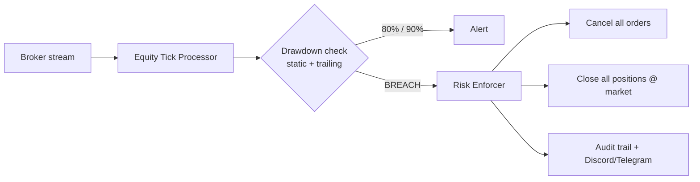
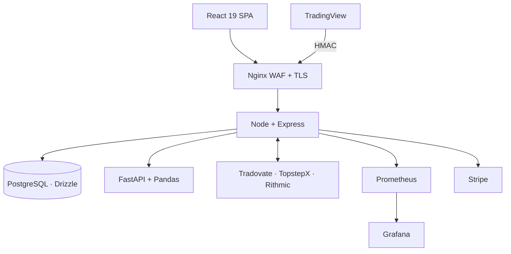

<div align="center">

# ⚡ VERTEX COMMAND
## The Prop-Trading Command Center

**One cockpit for every funded account.**
*Live execution · automated risk enforcement · copy trading · journal · analytics*

`React 19` · `Node + Express` · `PostgreSQL` · `Python/Pandas` · `Go` · `Docker`

</div>

---

> **Slide deck format.** Each `---` is a slide. Render with any Markdown slideshow
> (Marp, reveal.js, VS Code preview) — or just scroll.

---

## 🎯 Slide 1 — The Problem

Prop-firm traders run **5, 10, 20+ funded accounts** across different firms at once.

- ❌ Each firm has its own dashboard, rules, and drawdown math
- ❌ One missed trailing-drawdown breach = a **blown account**
- ❌ No unified journal, no cross-account analytics
- ❌ Manually copying trades across accounts is slow and error-prone

> **The cost of a single missed breach is the entire account.**

---

## 💡 Slide 2 — The Solution

**Vertex Command** unifies every account into one real-time cockpit:

```
Brokers ──stream──▶ Vertex ──enforces──▶ Your rules, automatically
```

- ✅ Connect Tradovate · TopstepX · Rithmic with real API clients
- ✅ Live position + equity streaming (WebSocket / fast-poll)
- ✅ **Auto-flatten on breach** — before you can react
- ✅ Journal, analytics, copy trading, billing — all in one place

---

## 🛡️ Slide 3 — Killer Feature: Automated Risk Enforcement

The heart of the platform. Fully autonomous.



- High-water-mark tracking, static **and** trailing drawdown
- Idempotency lock + 60s cooldown — no double-flatten
- Full `risk_interventions` audit trail
- Reconciliation daemon recovers orphaned positions on reconnect

---

## 👥 Slide 4 — Copy Trading + Signal Ingestion

**Replicate one master across many followers — risk-checked.**

| Capability | Detail |
|---|---|
| Sizing | Proportional or fixed multiplier per follower |
| Filters | Per-symbol allow-lists, max position size |
| Risk pipeline | Restricted symbols, daily loss, margin, news embargo, slippage |
| Resilience | WebSocket-first + polling fallback, panic flatten, orphan detection |

**TradingView → live orders** via HMAC-SHA256 signed webhooks, atomic dedup,
and dynamic symbol mapping (update the front month with **zero code push**).

---

## 📊 Slide 5 — Journal + Analytics Engine

A full trading journal backed by a **Pandas microservice**.

- 📓 Entries, psychology, calendar, trade replay, playbooks
- 📥 CSV import/export, tax reports, shareable public report links
- 📈 **FastAPI + Pandas:** Profit Factor · Expectancy · R-multiples ·
  MAE/MFE · equity curve · win/loss streaks · latency & slippage

```
Node gateway ──auth + user_id──▶ FastAPI/Pandas ──vectorized──▶ metrics
```

> Multi-tenant isolation enforced on every query.

---

## 🏗️ Slide 6 — Architecture



**Polyglot by design:** TypeScript for the app, **Python** for vectorized analytics,
**Go** for low-latency signal fan-out.

---

## 🧱 Slide 7 — Tech Stack

| Layer | Technology |
|---|---|
| **Frontend** | React 19 · Vite 7 · Tailwind v4 · shadcn/ui · Framer Motion · Recharts · React Three Fiber · Zustand · TanStack Query |
| **Backend** | Node + Express 5 · TypeScript · Drizzle ORM · WebSocket · Zod |
| **Database** | PostgreSQL 15 · 26 tables · 5 schema modules |
| **Services** | Python FastAPI/Pandas · Go engine · Stripe · OpenAI · Gmail |
| **Infra** | Docker · Nginx WAF · Prometheus · Grafana · GitHub Actions · Redis |

---

## 🔐 Slide 8 — Security & Production-Readiness

Built like it handles real money — because it does.

- 🔑 **AES-256-GCM** credentials + TOTP secrets at rest
- 🔒 **2FA/TOTP**, account lockout, Helmet CSP, CSRF, XSS + CSV-injection guards
- 🚦 Multi-zone rate limiting + progressive slow-down (Postgres-backed)
- 📡 HMAC-signed webhooks, constant-time comparison
- 💾 Daily pg_dump backups · dependency scanning · security-event log
- 📊 Prometheus + 14-panel Grafana · SSE health stream · auto-rollback CI/CD

---

## 🌍 Slide 9 — Polish

- **4 languages** — Hebrew (RTL default), English, Arabic, Spanish
- **Theme engine** — light/dark/system + 10 accent presets
- **Mobile-first** — slide-out RTL-aware nav, compact KPI cards
- **3D telemetry** — WebGL scene driven by live risk state
- **Real-time everywhere** — SSE streams feed the UI without polling

---

## 💳 Slide 10 — Business Model

| Plan | Price | Accounts | Copy / Journal |
|---|---|---|---|
| Free | $0 | 2 | 0 / 0 |
| Basic | $29/mo | 5 | 3 / 1 |
| Pro | $79/mo | 15 | 10 / 5 |
| Unlimited | $199/mo | ∞ | ∞ / ∞ |

7-day trial · Stripe subscriptions · server-side feature gating · affiliate program.

---

## 📈 Slide 11 — By the Numbers

| Metric | Value |
|---|---|
| Broker integrations | **3** (Tradovate, TopstepX, Rithmic) |
| Database tables | **26** across 5 schema modules |
| Languages | **4** (he · en · ar · es) |
| Microservices | **3 runtimes** (Node · Python · Go) |
| Grafana panels | **14** |
| Baseline heap | **~52 MB** (down from ~160 MB) |
| Production services | **7** (Docker Compose) |

---

## 🚀 Slide 12 — Run It in 5 Commands

```bash
npm install
cp .env.example .env                                # set keys
docker compose -f docker-compose.dev.yml up -d      # Postgres :5433
npm run db:push                                     # first run only
npm run dev                                          # → http://localhost:5000
```

---

<div align="center">

## ⚡ VERTEX COMMAND

### Your accounts, one cockpit. Risk enforced before you can blink.

*See [`README.md`](./README.md) for full setup · [`CLAUDE.md`](./CLAUDE.md) for the deep architecture reference.*

</div>
